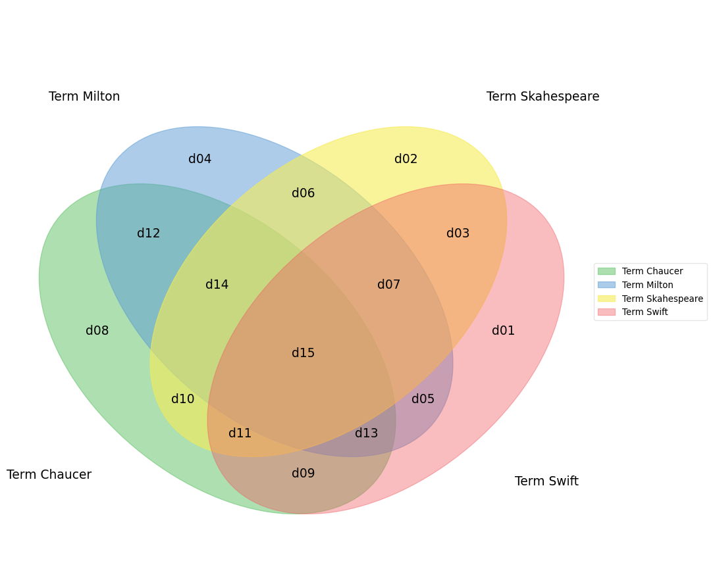

# pyvenn

2 ~ 6 Sets Venn Diagram For Python

## Configuration

Checkout this repository first:

```py
git clone hhttps://github.com/ilos-vigil/pyvenn.git
cd pyvenn
```

Use magic function in an ipython notebook:

```py
%matplotlib inline

import venn
```

Or use a non-interactive backend:

```py
import matplotlib
matplotlib.use('Agg')

import venn
```

## Example

> Open `demo.py` to run this example

Fetch labels for each subset of the venn diagram. The input argument is an array of iterable data(list, set, etc.). You will get a mapping table, where "10" indicates the number of elements in set 1 but not in set 2, "01" indicates the number of elements in set 2 but not in set 1, and so on.

```py
In [5]: labels = venn.get_labels([
            range(10),
            range(5, 15)
        ], fill=['number', 'logic'])
In [6]: print labels
Out [6]: {'01': '01: 5', '10': '10: 5', '11': '11: 5'}
```

Plot functions are based on the labels:

```py
fig, ax = venn.venn2(labels, names=['list 1', 'list 2'])
fig.show()
```


More examples:

```py
labels = venn.get_labels([range(10), range(5, 15), range(3, 8)], fill=['number', 'logic'])
fig, ax = venn.venn3(labels, names=['list 1', 'list 2', 'list 3'])
fig.show()
```


```py
labels = venn.get_labels([range(10), range(5, 15), range(3, 8), range(8, 17)], fill=['number', 'logic'])
fig, ax = venn.venn4(labels, names=['list 1', 'list 2', 'list 3', 'list 4'])
fig.show()
```


```py
labels = venn.get_labels([range(10), range(5, 15), range(3, 8), range(8, 17), range(10, 20)], fill=['number', 'logic'])
fig, ax = venn.venn5(labels, names=['list 1', 'list 2', 'list 3', 'list 4', 'list 5'])
fig.show()
```


```py
labels = venn.get_labels([range(10), range(5, 15), range(3, 8), range(8, 17), range(10, 20), range(13, 25)], fill=['number', 'logic'])
fig, ax = venn.venn6(labels, names=['list 1', 'list 2', 'list 3', 'list 4', 'list 5', 'list 6'])
fig.show()
```


## Example (fill mode 'data')

> Open `demo_data.ipynb` to run this example

Fill mode 'data' is intended to show position of data in diagram. It can works with other fill modes, but it ignores data duplication.

```py
salty_food_ingredients = ['Tomato Sauce', 'Cheese', 'Salt']
sweet_food_ingredients = ['Caramel', 'Cheese']

labels = venn.get_labels(
    [salty_food_ingredients, sweet_food_ingredients], fill=['data'])
fig, ax = venn.venn2(
    labels, names=['Salty food ingredients', 'Sweet Food Ingredients'])
```


```py
action_game = ['Mass Effect', 'Terraria', 'CS:GO',
               'Half-Life: Alyx', 'Bioshock']
adventure_game = ['Terraria', 'This War of Mine',
                  'Disco Elysium', 'Half-Life: Alyx']
rpg_game = ['Mass Effect', 'Dragon Age', 'Terraria',
            'Disco Elysium', 'Stardew Valley', 'Bioshock']

labels = venn.get_labels([action_game, adventure_game, rpg_game], fill=[
                         'data'], split_with_new_line=True)
fig, ax = venn.venn3(
    labels, names=['Action Game', 'Adventure Game', 'RPG Game'])
```


```py
# d -> document
term_chaucer = ['d08', 'd09', 'd10', 'd11', 'd12', 'd13', 'd14', 'd15']
term_milton = ['d04', 'd05', 'd06', 'd07', 'd12', 'd13', 'd14', 'd15']
term_skahespeare = ['d02', 'd03', 'd06', 'd07', 'd10', 'd11', 'd14', 'd15']
term_swift = ['d01', 'd03', 'd05', 'd07', 'd09', 'd11', 'd13', 'd15']

labels = venn.get_labels(
    [term_chaucer, term_milton, term_skahespeare, term_swift], fill=['data'])
fig, ax = venn.venn4(
    labels, names=['Term Chaucer', 'Term Milton', 'Term Skahespeare', 'Term Swift'])
```



```py
# d -> document
term_indie = [
    'd01', 'd03', 'd05', 'd07', 'd09', 'd11', 'd13', 'd15',
    'd17', 'd19', 'd21', 'd23', 'd25', 'd27', 'd29', 'd31'
]
term_action = [
    'd02', 'd03', 'd06', 'd07', 'd10', 'd11', 'd14', 'd15',
    'd18', 'd19', 'd22', 'd23', 'd26', 'd27', 'd30', 'd31'
]
term_adventure = [
    'd04', 'd05', 'd06', 'd07', 'd12', 'd13', 'd14', 'd15',
    'd20', 'd21', 'd22', 'd23', 'd28', 'd29', 'd30', 'd31'
]
term_casual = [
    'd08', 'd09', 'd10', 'd11', 'd12', 'd13', 'd14', 'd15',
    'd24', 'd25', 'd26', 'd27', 'd28', 'd29', 'd30', 'd31'
]
term_simulation = [
    'd16', 'd17', 'd18', 'd19', 'd20', 'd21', 'd22', 'd23',
    'd24', 'd25', 'd26', 'd27', 'd28', 'd29', 'd30', 'd31'
]

labels = venn.get_labels(
    [term_indie, term_action, term_adventure, term_casual, term_simulation], fill=['data'])
fig, ax = venn.venn5(
    labels, names=['Term Indie', 'Term Action', 'Term Adventure', 'Term Casual', 'Term Simulation'])
```


```py
d1 = np.random.randint(25, 55, size=50)
d2 = np.random.randint(25, 55, size=50)
d3 = np.random.randint(25, 55, size=50)
d4 = np.random.randint(25, 55, size=50)
d5 = np.random.randint(25, 55, size=50)
d6 = np.random.randint(25, 55, size=50)

labels = venn.get_labels([d1, d2, d3, d4, d5, d6], fill=['data'])
fig, ax = venn.venn6(
    labels, names=['Range 0-30', 'Range 5-35', 'Range 10-40', 'Range 15-45', 'Range 20-50', 'Range 25-35'])
```

